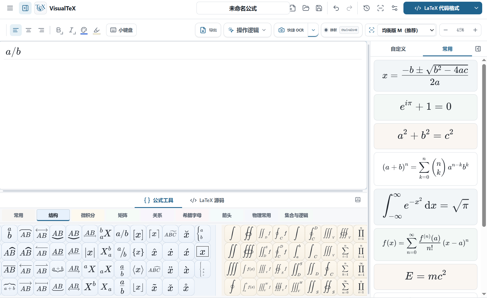

<div align="center">
  
  <h1>VisualTeX</h1>
  <p><strong>面向科研写作的可视化公式编辑器</strong></p>
  <p>可视化输入 · LaTeX 源码编辑 · MathType 兼容 · Word / PowerPoint 插件 · 公式 OCR</p>
  <p>
    <a href="https://visualtex.pauljianliao.com/">官方网站</a> ·
    <a href="https://github.com/paulhe666/visualtex/releases">下载安装</a> ·
    <a href="apps/macos/docs/help/VisualTeX_帮助手册.md">帮助手册</a>
  </p>
</div>

---

VisualTeX 是一款面向 macOS 和 Windows 的公式编辑器，适合写论文、整理报告和制作课件。你可以直接在可视化编辑区输入公式，也可以随时切到 LaTeX 源码里细调；写好的公式能直接插入 Word 或 PowerPoint，之后仍可继续编辑、转换、编号和引用。

<div align="center">
  
</div>

## 公式编辑

写公式时不必频繁切换鼠标和键盘。常用结构既能从工具栏选择，也能通过命令候选和快捷键快速输入。

- 支持分式、根式、上下标、积分、求和、极限、重音、定界符、希腊字母、集合、关系、箭头和常用物理符号。
- 支持多行公式以及自定义尺寸的矩阵。
- `align` 和 `aligned` 可以直接设置 `&` 对齐点，`cases` 对多行分段函数做了单独适配。
- 每一行都可以单独设为行内或行间公式；文字与公式混排使用 `$...$`。
- Enter、Tab、结构跳出、选区包裹和命令补全都针对公式输入进行了调整。
- 粗体、数学斜体和正体可以直接对选中内容切换。
- 支持自定义公式快捷键、希腊字母快捷输入、常用工具和自定义公式磁贴。
- 普通模式与小键盘模式分别记忆窗口大小，适合桌面编辑和紧凑输入。
- 撤销、重做和历史记录会保留公式内容、活动行、光标与选区。

## LaTeX 源码区

可视化编辑区和源码区保持双向同步，既可以直接搭建公式，也可以在源码中精确修改。

源码区基于 CodeMirror，支持：

- LaTeX 语法高亮，不同类型的命令使用不同颜色；
- 行号、当前行高亮、括号匹配和代码折叠；
- 环境层级缩进、缩进引导线、自动缩进以及 Tab / Shift+Tab；
- `equation`、`align`、`aligned`、`gather`、`multline`、`split`、矩阵等多行环境；
- 纯 LaTeX、`$...$`、`\(...\)`、`\[...\]` 等复制格式。

日常复制和导出不需要安装 TeX Live。

## MathType 兼容（Windows）

Windows 版可以直接处理 Word 中的 MathType 7 原生 OLE 公式，不会把它们简单转成截图。VisualTeX 会读取 MathType 公式内容，并尽量保留原来的行内/行间状态、字号、位置、编号和引用。

目前支持：

- 使用 VisualTeX 打开并修改所选 MathType 公式；
- VisualTeX OLE 与 MathType OLE 双向转换；
- Word OMML 与 MathType OLE 双向转换；
- 将 LaTeX 重绘为 VisualTeX OLE、Word OMML 或 MathType；
- 将 VisualTeX、OMML、MathType 公式恢复为 LaTeX；
- 对选中部分或全文批量转换；
- 处理 MathType 左编号和右编号；
- 保留 `MTDisplayEquation`、`MTPlaceRef`、`MTEqn`、`MTChap`、`MTSec`、`ZEqnNum` 等原生编号与引用结构；
- 同时更新文档中的 VisualTeX 编号、MathType 编号及相关引用。

需要调用 MathType 原生编辑或渲染能力时，电脑上仍需正确安装 MathType。macOS 版目前以图片公式和 Word OMML 为主，MathType 原生 OLE 转换主要由 Windows 版提供。

## Word 插件

安装插件后，Word 顶部会出现 VisualTeX 工具栏。插入、编辑、转换、编号等常用操作都可以直接在 Word 里完成，不用在两个程序之间来回复制。

- 插入行内或行间公式。
- macOS 可以插入图片公式或 Word 原生 OMML。
- Windows 可以插入 VisualTeX OLE 或 Word OMML，也可以处理 MathType OLE。
- 支持通过工具栏编辑所选公式，也支持双击重新打开编辑器。
- 不同平台支持的格式略有区别，图片公式、OMML、VisualTeX OLE 和 MathType 之间可以按需转换。
- 编辑已有公式时会恢复 LaTeX、字号、显示方式和公式元数据。

### 公式编号与引用

Word 插件支持全文连续编号、按章编号和按节编号，也支持点号或短横线分隔。编号公式可以插在文档中间，引用会随编号更新。对于旧文档中残留或损坏的编号结构，可以使用“更新公式编号”重新整理。

### 批量导入与重绘

- 导入 LaTeX 或 Markdown，普通文字仍是 Word 原生段落。
- 文档中的每个行内公式和行间公式都会成为独立对象，可以分别编辑和调整字号。
- 可以扫描选区或全文中的 `$...$`、`\(...\)`、`$$...$$` 和 `\[...\]`。
- 可以把选区或全文原位重绘为 VisualTeX 公式、Word OMML；Windows 版还可以重绘为 MathType。
- 行内公式会参考周围正文的字号，行间公式会参考相邻段落，尽量不破坏原有排版。
- 批量处理带有预检、缓存和失败回退，避免转换中途留下不完整公式。

## PowerPoint 插件

macOS 使用原生 PPAM 加载项，Windows 使用原生 VSTO 加载项。两端都可以新建公式、编辑或替换所选公式、删除公式，并从 PowerPoint 打开 VisualTeX。

Windows 版使用真实的 VisualTeX OLE 对象，并提供图片、OLE、OMML 等格式之间的转换。macOS 版使用本地矢量和图片公式，适合在演示文稿中继续调整内容与尺寸。

## 公式 OCR

图片可以通过文件选择、拖放、剪贴板粘贴或区域截图送入 OCR，识别出的 LaTeX 会直接回到当前编辑位置。多行识别结果可以继续按多行公式编辑。

### 本地识别

本地 OCR 使用 PaddleOCR PP-FormulaNet，图片不会发送到第三方服务。

- plus-S：速度优先，模型较小；
- plus-M：兼顾中文、复杂公式与速度，默认推荐；
- plus-L：精度优先，适合较复杂的公式图片。

完整 OCR 窗口适合检查和修改结果；快捷 OCR 用于截图后立即回填；静默 OCR 会在后台识别并把 LaTeX 放入剪贴板。

### 在线与自建服务

也可以接入 OpenAI 兼容接口、Ollama、Mathpix、PaddleOCR-VL 1.6 或 SimpleTex。只有主动选用在线服务时，图片才会发送到对应接口；API 地址、模型和密钥都由你在本机设置。

## 导出与个性化

- 复制 LaTeX 或 PNG。
- 导出 Markdown、SVG 和 PNG。
- 支持透明背景以及自定义 PNG 背景色。
- 导出目录和常用输出设置可以自动记忆。
- 支持中英文界面、多套主题和完整配色自定义。
- 公式字号、工具栏大小、面板状态、编辑模式等设置会在重启后保留。
- 配置可以备份和迁移。
- 内置自定义字符设计器，可以组合矢量字形、注册 LaTeX 命令，并在编辑、补全、SVG、PNG 和 Office 图片公式中继续使用。

## 平台说明

| | macOS | Windows |
|---|---|---|
| 桌面应用 | React、TypeScript、Tauri | React、TypeScript、Tauri |
| Word 插件 | DOTM、VBA、AppleScriptTask、本地 Session | VSTO Ribbon、Office 事件、COM |
| PowerPoint 插件 | PPAM、本地 Session | VSTO Ribbon、OLE |
| 主要公式格式 | 图片公式、Word OMML | VisualTeX OLE、Word OMML、图片公式、MathType OLE |
| MathType | 可与现有文档共存 | 原生 OLE 编辑、转换、编号和引用 |
| 插件维护 | 应用内安装、更新和修复 DOTM / PPAM | 安装器部署与 Office 位数匹配的原生组件 |

macOS 和 Windows 拥有各自独立的源码、依赖、Office 插件和构建流程。两端使用一致的公式元数据约定，使图片公式和 OMML 在跨平台文档中尽量保留 LaTeX、公式 ID 与显示方式。

## 下载

- [VisualTeX 官方网站](https://visualtex.pauljianliao.com/)
- [GitHub Releases](https://github.com/paulhe666/visualtex/releases)
- [macOS 帮助手册](apps/macos/docs/help/VisualTeX_帮助手册.md)

macOS 版本要求 macOS 11 或更高版本。Office 功能需要本机安装 Microsoft Word 或 PowerPoint；Windows 的 MathType 原生功能还需要相应的 MathType 安装环境。

## 开发

仓库中的两个平台相互独立：

```text
visualtex/
├── apps/
│   ├── macos/       # macOS 应用、Tauri、DOTM/PPAM、OCR 与测试
│   └── windows/     # Windows 应用、Tauri、VSTO/OLE、OCR 与测试
├── docs/            # 架构文档与 README 图片
├── tools/           # 仓库结构检查
└── README.md
```

常用命令：

```bash
npm run bootstrap
npm run build:macos
npm run build:windows
npm run test:repository
npm run check
```

详细架构见 [docs/ARCHITECTURE.md](docs/ARCHITECTURE.md)。平台相关的构建与测试说明见 [apps/macos/README.md](apps/macos/README.md) 和 [apps/windows/README.md](apps/windows/README.md)。

## 开源协议

VisualTeX 使用 [MIT License](LICENSE)。

## 支持 VisualTeX

如果 VisualTeX 对你的论文、报告或课件排版有所帮助，欢迎支持项目继续开发。使用问题、功能建议和 Office 插件相关交流可加入 QQ 群：`1045801770`。

<p align="center">
  
  &nbsp;
  
  &nbsp;
  
</p>
